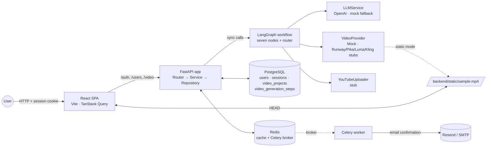
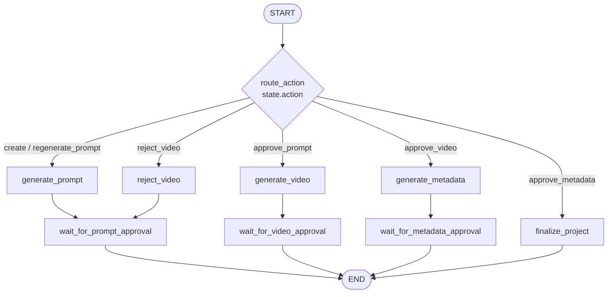

# YouTube Video Generator

A small full-stack MVP that walks a user through producing a YouTube
video end-to-end: enter a topic → get an AI-generated video prompt →
edit / approve → generate a mock video → approve or reject → get
AI-written YouTube title, description and tags → finalize and download.

The video generator itself is currently a **mock** (returns a placeholder
URL or a static sample file). The architecture is built around a clean
provider interface so Runway / Pika / Luma / Kling can be wired in
later as one-file additions.

---

## Tech Stack

| Layer | Tech |
|-------|------|
| Backend | FastAPI · SQLAlchemy 2 (async) · Alembic · Pydantic v2 |
| Background work | Celery 5 (used for email) · Redis 7 |
| Database | PostgreSQL 17 |
| LLM orchestration | LangGraph + langchain-openai (gpt-4o-mini) |
| Auth | Session cookies (httpOnly), bcrypt-hashed passwords, email confirmation |
| Email | Resend API (Gmail SMTP fallback) |
| Frontend | React 19 · Vite 7 · TypeScript · Tailwind CSS 4 · TanStack Query · React Router 7 |
| Runtime / packaging | Python 3.14 + `uv`, Node 22 |
| Deployment | Docker Compose |

---

## Architecture



**Layers**

- **Router → Service → Repository** in every backend module. The
  router owns HTTP + DI; the service holds business logic and status
  guards; the repository is the only place that touches the DB.
- **LangGraph workflow** is rebuilt per request with services injected
  (DB session bound to the request). Each "doing" node writes its
  outputs to the DB *before* returning, so workflow progress is durable
  across process restarts — the database is the source of truth.
- **Provider abstractions** isolate every external concern:
  - `LLMService` wraps the OpenAI / mock provider for prompt + metadata.
  - `VideoProvider` ABC + per-provider files (`mock.py`,
    `runway.py`, `pika.py`, `luma.py`, `kling.py`).
  - `YouTubeUploader` is currently a stub.
- **Frontend** uses TanStack Query for all server state. Mutations
  `setQueryData` on success and `invalidateQueries` on settle (so error
  responses also refresh the project view).
- **Auth** is session-based via an httpOnly `session_token` cookie set
  by `/auth/login`. Cookies are sent with `credentials: 'include'`.

---

## LangGraph Workflow

A single compiled graph with seven nodes covers every workflow step:



Each user HTTP request runs the graph from START to END. The router at
START dispatches by `state.action`; downstream "wait" nodes mark the
project as parked in the relevant phase. The graph never blocks waiting
for human input — control returns to FastAPI and the user makes another
HTTP call to trigger the next action.

### Workflow state machine (data side)

```
workflow_status   :  PROMPT  →  VIDEO  →  METADATA  →  COMPLETED
                       ↑           │
                       └─reject────┘
                                                  (FAILED on any error)

prompt_status     :  PENDING → READY (or FAILED)
video_status      :  PENDING → GENERATING → READY (or FAILED)
metadata_status   :  PENDING → READY (or FAILED)
```

The four enums on `video_projects` are independent. The `workflow_status`
is the user-facing phase; the per-phase statuses (`prompt_status` etc.)
track work inside that phase.

---

## Setup

### Prerequisites

- Docker + Docker Compose
- (Optional, for local dev outside Docker) Python 3.14, Node 22, `uv`

### First-time setup

```bash
git clone <repo>
cd youtube-video-generator
cp .env.example .env
# Edit .env — at minimum, set OPENAI_API_KEY if you want real LLM output.
# Without a key the LLMService auto-falls-back to deterministic mock
# responses, so the workflow still runs end-to-end.

docker compose run --rm migrate     # apply Alembic migrations
docker compose up                   # api + worker + redis + postgres + frontend
```

Services after `docker compose up`:

| Service | URL |
|---------|-----|
| FastAPI | http://localhost:8000 |
| API docs (Swagger) | http://localhost:8000/docs |
| Frontend (Vite) | http://localhost:3000 |
| Static files | http://localhost:8000/static/ |

---

## Environment Variables

| Variable | Default | Purpose |
|----------|---------|---------|
| `DATABASE_URL` | — | asyncpg PostgreSQL DSN |
| `POSTGRES_HOST` / `_PORT` / `_DB` / `_USER` / `_PASSWORD` | — | Used by the postgres service in compose |
| `CELERY_BROKER_URL` | `redis://redis:6379/1` | Redis DB 1 |
| `CELERY_RESULT_BACKEND` | `redis://redis:6379/2` | Redis DB 2 |
| `REDIS_URL` | `redis://redis:6379/0` | App cache (Redis DB 0) |
| `LLM_PROVIDER` | `openai` | `openai` or `mock`; auto-mocks if API key is empty |
| `OPENAI_API_KEY` | `""` | OpenAI key. Empty → mock fallback. |
| `OPENAI_MODEL` | `gpt-4o-mini` | LLM model name |
| `VIDEO_PROVIDER` | `mock` | `mock` / `runway` / `pika` / `luma` / `kling` (only mock is wired) |
| `MOCK_VIDEO_MODE` | `placeholder` | `placeholder` (fake CDN URL) or `static` (serves `/static/sample.mp4`) |
| `MOCK_VIDEO_CDN_BASE` | `https://mock-cdn.example.com/videos` | Placeholder base URL when in placeholder mode |
| `RUNWAY_API_KEY` / `PIKA_API_KEY` / `LUMA_API_KEY` / `KLING_API_KEY` | `""` | Reserved for future integrations |
| `RESEND_API_KEY` | — | Email provider key (used by Celery worker for auth confirmation) |
| `SENDER_EMAIL` / `EMAIL_APP_PASSWORD` | — | Gmail SMTP fallback if Resend isn't configured |
| `BASE_URL` | `http://localhost:8000` | Public API URL (used in email links + static-mode video URL) |
| `ORIGINS` | `["http://localhost:3000"]` | JSON array of allowed CORS origins |
| `HTTPS_REDIRECT` | `false` | Force-https middleware toggle |

---

## Running the Backend

Inside Docker (recommended):

```bash
docker compose up api worker postgres redis
docker compose run --rm migrate   # any time you change models
```

Locally with `uv` (requires Postgres + Redis reachable on host):

```bash
cd backend
uv sync
uv run alembic upgrade head
uv run uvicorn src.main:app --reload --host 0.0.0.0 --port 8000
# in another terminal, for email tasks:
uv run celery -A src.celery_app.celery_main:celery_app worker --loglevel=info
```

Useful one-offs:

```bash
uv run alembic revision --autogenerate -m "describe change"
uv run ruff check . && uv run ruff format .
uv run python -c "from src.video.workflow import build_workflow_graph; print('ok')"
```

---

## Running the Frontend

Inside Docker (compose service `frontend` already in `docker-compose.yml`):

```bash
docker compose up frontend
# http://localhost:3000
```

Locally (with the API running on `localhost:8000`):

```bash
cd frontend
npm install
npm run dev          # Vite dev server on http://localhost:5173
                     # dev proxy forwards /auth, /users, /video → :8000
npx tsc --noEmit     # type-check
```

---

## End-to-end smoke test

After `docker compose up`:

1. Open `http://localhost:3000`, register a user, click the confirmation
   link from the worker logs (or the Resend email), sign in.
2. **New Project** → enter a topic → spinner → land on the prompt step
   with a generated prompt populated.
3. Optionally **Regenerate**, then edit the textarea, then click
   **Edit & Approve**.
4. Watch the spinner for video generation; the mock takes ~2 s.
5. Click **Approve Video** → metadata spinner → title + description
   editor with tag pills.
6. Click **Edit & Finalize** → completed view with video, title,
   description, tags, download link, YouTube stub button.
7. From the dashboard the project is now marked **Completed**.

---

## Current MVP Limitations

- **Video generation is fake.** `MockVideoProvider` returns either a
  placeholder CDN URL or `BASE_URL/static/sample.mp4` (drop your own
  MP4 there). The Runway/Pika/Luma/Kling provider classes exist as
  inert stubs.
- **LLM calls are inline.** `/video/projects` and the three approve
  routes call the LLM synchronously in the request handler. With
  `gpt-4o-mini` that's 2–5 s per call; with larger models or async
  providers it would need to move to Celery or a streaming endpoint.
- **YouTube publishing is a stub.** No OAuth flow, no Data-API
  integration. The "Publish to YouTube" button hits a stub endpoint.
- **No tests.** The project ships with pytest + pytest-asyncio + httpx
  + aiosqlite configured in `pyproject.toml` but no `tests/` directory
  yet. Adding tests is a clear next step.
- **Auth is single-user-per-session.** No multi-device session
  management UI, no refresh tokens, no OAuth providers.
- **`/static` mount is unauthenticated.** Fine for a placeholder
  sample; real videos would need signed URLs or per-user storage.
- **`improve_video_prompt` LLM method exists but isn't wired into
  the UI.** Currently the only "give me a different prompt" path is
  **Regenerate**, which generates fresh from the topic. A future
  iteration could collect user feedback text and pass it to
  `improve_video_prompt`.
- **No streaming LLM output.** Each call shows a spinner and then the
  final text.

---

## Future Improvements

- **Real video provider integration.** Implement `generate()` in
  `runway.py` (or whichever provider you prefer). The workflow already
  branches on `VideoResult.is_complete`, so async providers can leave
  the project in `GENERATING` and a Celery poller can resolve it later.
- **"Refine" loop using `improve_video_prompt`.** Add a route + UI
  that lets the user paste feedback and gets a revised prompt.
- **Move LLM calls to Celery.** Drop the inline `await` in the
  workflow nodes; have the routes return immediately with
  `*_status=PENDING` and rely on the polling endpoint.
- **Streaming responses.** Use OpenAI streaming + Server-Sent Events
  so the prompt textarea fills in as the LLM types.
- **Real YouTube publishing.** OAuth flow, Data API v3 upload, status
  polling, thumbnail upload.
- **Tests.** Pytest fixtures for an async session + sqlite, plus
  integration tests for each workflow transition. The plan file in
  `~/.claude/plans/` describes the gaps in detail.
- **Per-user object storage.** S3 / R2 with signed URLs replacing the
  `/static` mount.
- **Observability.** Structured logs, request IDs, Sentry, basic
  Prometheus metrics on workflow status transitions.

---

## License

[MIT](LICENSE)
